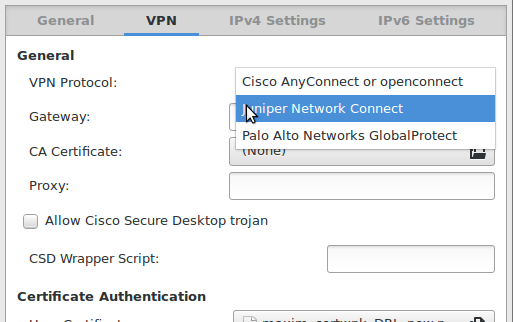

# network-manager-openconnect

This is [`network-manager-openconnect`](https://git.gnome.org/browse/network-manager-openconnect/) extended with the multiprotocol support that will (hopefully) soon be included in the `libopenconnect` API.

You'll need to build `libopenconnect` from [dlenski/openconnect:globalprotect branch](https://github.com/dlenski/openconnect/tree/globalprotect) in order to test it out, for the time being.

## Super amazing screenshot

